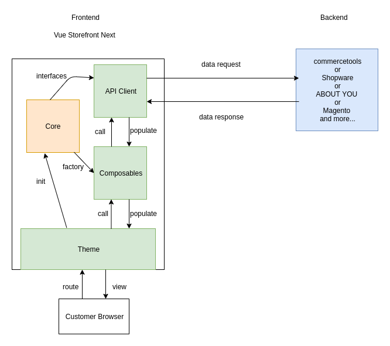

# Architecture

_Vue Storefront Next_ has been built upon the idea of _microservice architecture_, that is, also known as, including but not limited to _agnostic design_, _declarative protocol_, _modular packages_, and basically all the good things you can think of when it comes to software development. (It's not the one shot perfect solution, but let's focus on good things first)

Throughout the countless trials and errors, we have managed to come up with a better solution that fits the ideal structure we had aimed at with low coupling and high cohesion. (Still improving and it will never stop improving though)

We are going to talk about the underlying architecture of _Vue Storefront Next_ in this section including _Templates_, _API_, _Theme_, and other components with visual representation. 

[[toc]]

## Templates
All the integration have their own best practices and in case of _Vue Storefront Next_, we prepared _boilerplate_ template for the starting point for that matter. The `boilerplate` packages are the minimum template to guide your own integration. They consist of 3 individual packages; ___API client___, ___Composables___, and ___Theme___. 

This is the simple overview of how _Vue Storefront Next_ works. For an integration to fully work, you need to prepare those 3 packages in green, and _boilerplate_ packages are there for just that purpose helping you start it with `boilerplate`, `boilerplate-api`, `boilerplate-theme` in `npm` package which is linked to `./packages/boilerplate` and its equivalent subfolder. 

Here is a story. Your customer visits your online shop powered by _Vue Storefront Next_. It is a product page with a certain `route`. The `core` part of app will be initialized creating _Composables_ to make API calls to backend frameworks via _API client_. Once the data is successfully fetched, then it will be passed down to _Composables_ which then to populate _Theme_ files such as `pages/Product.vue` with requested data.

:::tip EVER WONDER? 
Why would we need _Composables_ before _API client_ when _Theme_ needs data? _Composables_ are basically [_Vue Composition API_](https://composition-api.vuejs.org/) which is designed to better organize features and enhance reusability. So the business logics needed for e-commerce platform are implemented in those _Composables_ for reusability and low coupling between _Presentation Layer_ and _Data Layer_.  

:::

## API
API client is a data layer of your eCommerce integration. It provides a friendly abstraction layer over network calls to your e-commerce platform.

It expresses each network request as a declarative method like `getProduct` or `getCategory`. By having this additional layer we can hide implementation details of how we get the data which gives you freedom of introducing major changes in this layer without influencing other parts of the app.

API client by itself is a Vanilla JavaScript application and it doesn't require any frontend framework to run. It's usually not used directly in the UI and is responsible only for providing data to _Composables_.

## Theme
It is presentation layer (TBD)

## Composables
It is service layer that deals with business logic. (TBD)
